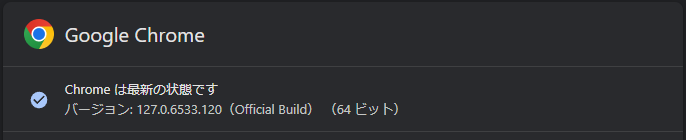
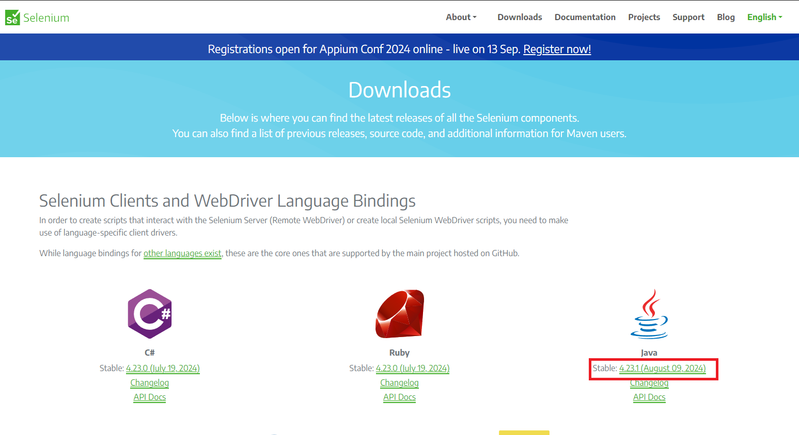
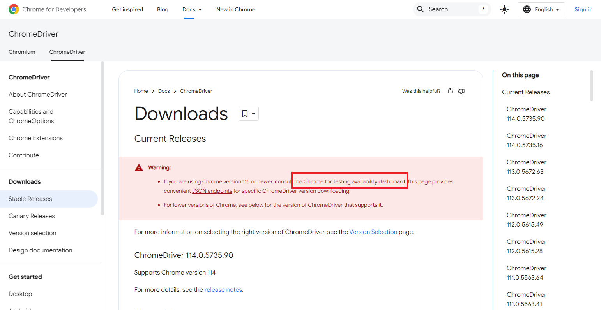
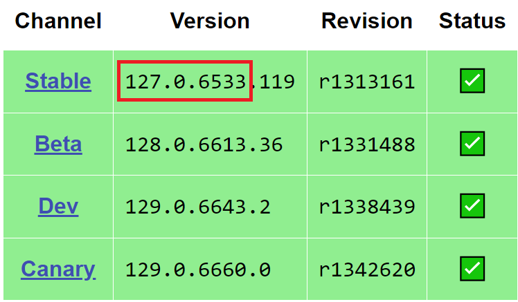
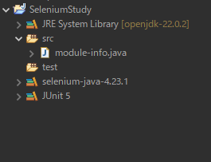
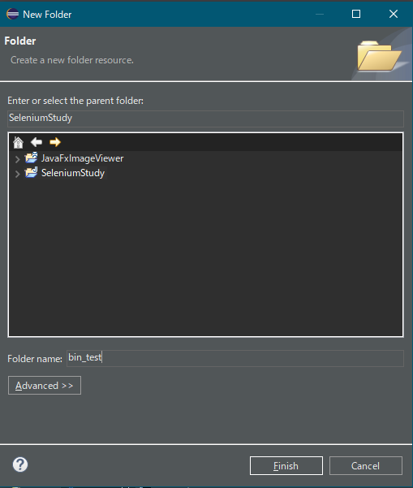
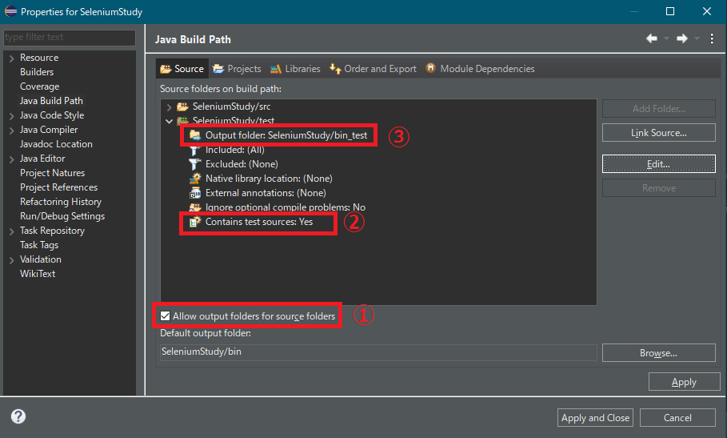

# Selenium導入手順

今回はChromeを自動操縦する。
Chromeのバージョンは`127.0.6533.120`なのでこれにあわせて設定を作る。

## 必要なものをダウンロードする

### [OpenJDK](https://openjdk.org)
- JDK 22.0.2 の Win 64 zipをダウンロードする。

### [ECLIPSE](https://www.eclipse.org/downloads/)
- Download Packages から、`Eclipse IDE for Java Developers`をダウンロードする。バージョンは`2024‑06 R`。

### [Selenium Clients and WebDriver Language Bindings](https://www.selenium.dev/downloads/)
- 以下より`selenium-java-4.23.1.zip`をダウンロードする。
- 

### [ChromeDriver](https://developer.chrome.com/docs/chromedriver/downloads)
1. `Chrome for Developers`のChromeDriverのダウンロードページにアクセスする。
1. 以下をクリックする。
	
1. [Chrome for Testing](https://googlechromelabs.github.io/chrome-for-testing/)ページから`Stable`を選択する。
	
1. `chromedriver`、`win64`、の[URL](https://storage.googleapis.com/chrome-for-testing-public/127.0.6533.119/win64/chromedriver-win64.zip)を取得し、zipファイルをダウンロードする。

## ダウンロードしたものをフォルダに展開する。

今回は、[JavaFxStudy](../JavaFxStudy)の作業フォルダに追加する形にした。
- 作業フォルダ
	- eclipse
		- eclipse-java-2024-06-R-win32-x86_64
		- eclipse-workspace
	- Java
		- openjdk-22.0.2
	- Selenium
		- chromedriver-win64
		- selenium-java-4.23.1

## Eclipse設定
1. Seleniumライブラリを登録する。
	1. Window > Preferences を選択する。
	1. Java > User libraries を選択する。
	1. `New`を押下して、`selenium-java-4.23.1`を登録する。 
		
	1. 作成した`selenium-java-4.23.1`を選択し`Add External JARs...`を押下する。
	1. `%作業フォルダ%/Selenium/selenium-java-4.23.1`のJARファイルを設定する。
1. 新規JavaProjectを作成する。
	1. 作成したプロジェクトを選択し、右クリックから`Properties`を選択する。
	1. `Java Build Path`を選択し、`Libraries`タブを選択する。
	1. `Classpath`を選択し、`Add Library...`を押下する。
		1. `User Library`を選択し、`Next`を押下する。
		1. `selenium-java-4.23.1`を選択し、`Finish`
	1. `Classpath`を選択し、`Add Library...`を押下する。
		1. `JUnit`を選択し、`Next`を押下する。
		1. `JUnit 5`を選択し、`Finish`
1. テスト用のフォルダを作成する。
	1. プロジェクト右クリックから、New > Source Folder を選択し、テスト用のソースフォルダ`test`を作成する。 
		
	1. プロジェクト右クリックから、New > Folder を選択し、テスト用のクラスフォルダ`bin_test`を作成する。 
		
	1. プロジェクト右クリックから`Properties`を選択する。
	1. `Java Build Path`を選択し、`Source`タブを選択する。
	1. `SeleniumuStudy/test`を展開する。 
		
		1. `Allow output folders for source folders`にチェックを入れる。
		1. `Conteins test sources`をダブルクリックし、`Yes`に変更する。
		1. `Output folder`を選択した状態で`Edit`ボタンを押下し、bin_testフォルダを選択する。
	1. 正しく設定できていると、Package Explorer からbin_testフォルダが見えなくなる。

## 参考文献

- セットアップ
	- [最新のChromedriverの設定　vol.2](https://qiita.com/Chronos2500/items/7f56898af25523d04598)
	- [Eclipse：Java9モジュールシステムを使うと共にJUnitを使う方法](https://www.gwtcenter.com/using-module-system-with-junit-on-eclipse)
	- [2.1 Javaモジュールシステム（モジュール定義ファイル、モジュールパス、ルートモジュール、自動モジュール、無名モジュールなど）～Java Advanced編](https://qiita.com/KenyaSaitoh/items/a04a1e94d28153fd1afb)
- Chromeをモード指定してで開く
	- [Chrome固有の機能](https://www.selenium.dev/ja/documentation/webdriver/browsers/chrome/)
	- [PythonでヘッドレスChromeをシークレットモードで開いてやんよ!!!](https://tokidoki-web.com/2018/12/python%E3%81%A7%E3%83%98%E3%83%83%E3%83%89%E3%83%AC%E3%82%B9chrome%E3%82%92%E3%82%B7%E3%83%BC%E3%82%AF%E3%83%AC%E3%83%83%E3%83%88%E3%83%A2%E3%83%BC%E3%83%89%E3%81%A7%E9%96%8B%E3%81%84%E3%81%A6/)
	- [✨Chromeをいっしょにキラキラさせよ✨：起動オプション🚀Seleniumと組み合わせちゃおっ💖](https://qiita.com/OtakuFriendlyGalEncoder/items/eb7eb0bc83401a312c69)
